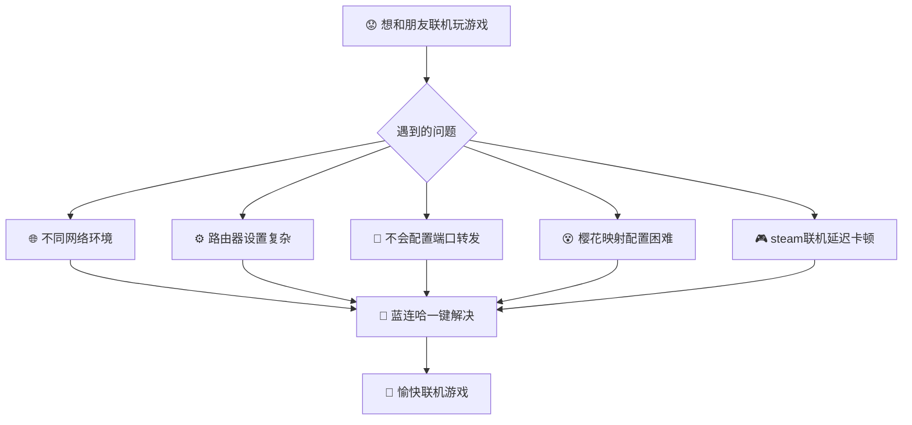
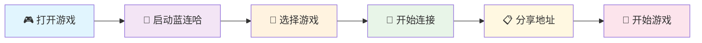
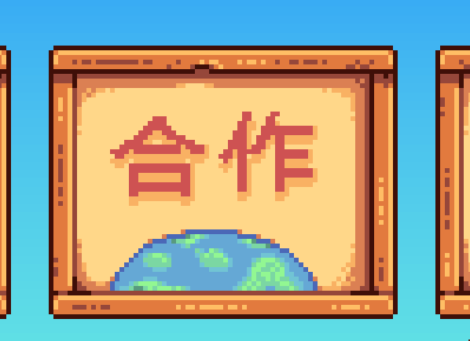
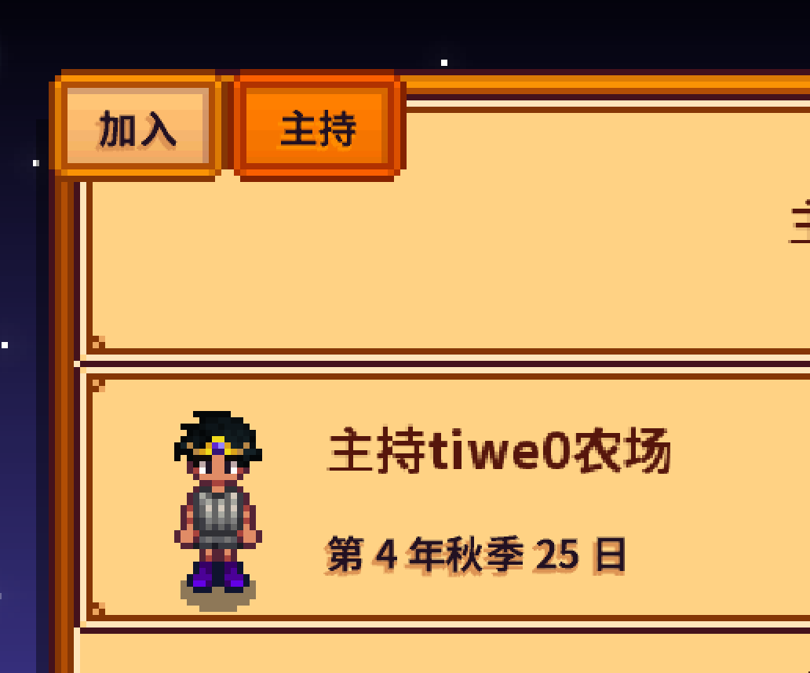
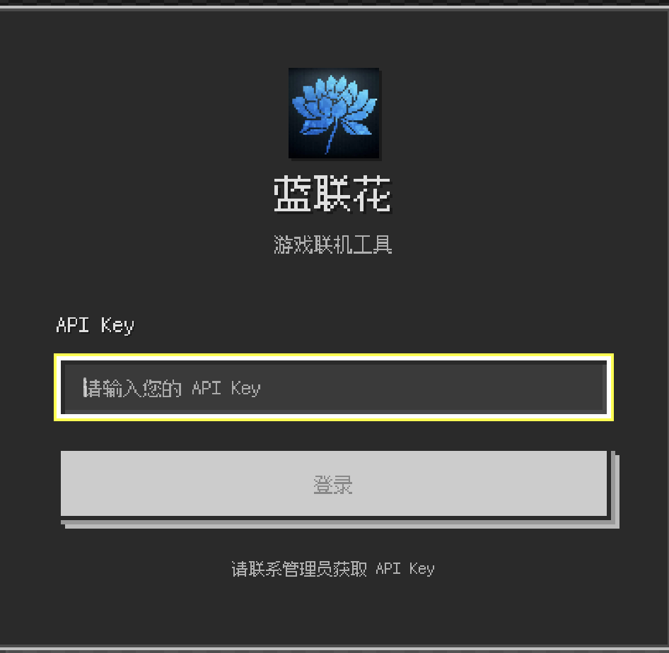
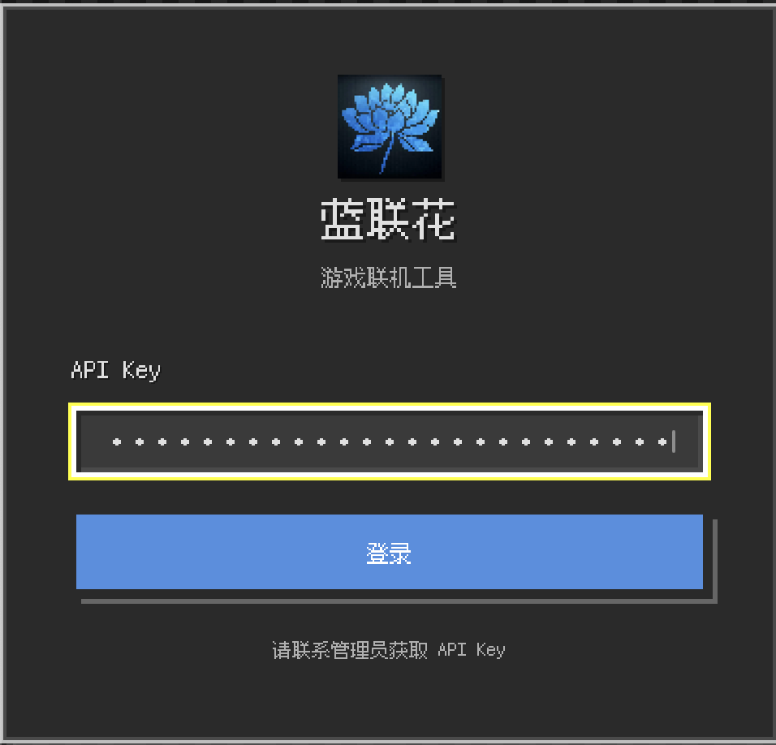
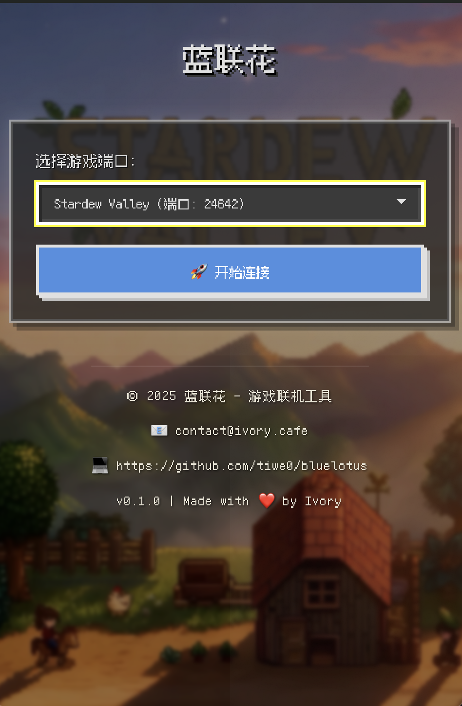
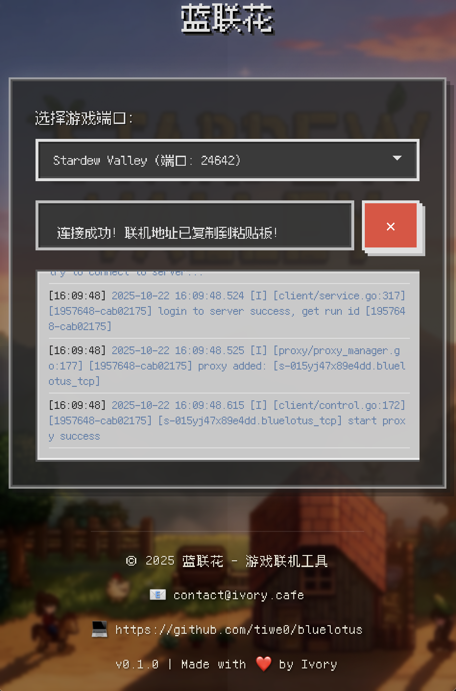
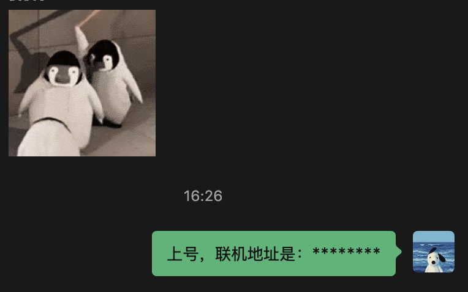

# 🌸 蓝连哈 - 游戏联机工具

  
  
  

  <strong>🎮 一个简单易用的游戏内网穿透工具，帮助你和朋友一起玩局域网游戏！</strong>

  <em>支持 Minecraft、Terraria、星露谷物语等热门游戏</em>

---

## ✨ 功能特色

<table>
<tr>
<td width="50%">

### 🎮 游戏支持
- **Minecraft** (Java & Bedrock)
- **Terraria** 
- **星露谷物语**
- **自定义端口**

</td>
<td width="50%">

### 🚀 核心功能
- **一键连接** Sakura FRPC
- **实时日志** 连接状态
- **界面友好** 小白易用
- **游戏主题** 专属背景

</td>
</tr>
</table>

> 🎵 **核心卖点**: 舒缓的哈基米音乐 (播放完就停止)

## 🎯 适用场景

<strong>🌸 蓝连哈帮你解决这些问题！</strong>

## 软件获取
从 [发布页面](https://github.com/tiwe0/bluelotus/releases) 下载最新版本的蓝连哈

## 🚀 快速开始

### 📝 详细步骤

<strong>第一步：🎮 打开游戏</strong>

<table>
<tr>
<td align="center" width="33%">

 <em>🎯 第一步</em>
</td>
<td align="center" width="33%">

 <em>🎮 第二步</em>
</td>
<td align="center" width="33%">

 <em>🚀 第三步</em>
</td>
</tr>
</table>

作为房主的玩家打开游戏，创建房间

<strong>第二步：🌸 启动蓝连哈</strong>

<table>
<tr>
<td align="center" width="50%">

 <em>📱 启动软件界面</em>
</td>
<td align="center" width="50%">

 <em>🔑 APIKey登录</em>
</td>
</tr>
</table>

填入你的樱花映射(Sakura FRPC)的APIKey（该Key只需要输入一次，后续会自动登陆）进行登陆。

> 💡 **提示**: 该Key仅保存在本地和与樱花映射服务器交互。

<strong>第三步：🎯 选择游戏</strong>

 <em>🎮 游戏选择界面</em>

在蓝连哈中选择对应的游戏

<strong>第四步：🚀 开始连接</strong>

 <em>🚀 连接状态界面</em>

点击"🚀 开始连接"按钮，等待连接成功

<strong>第五步：📋 分享地址</strong>

 <em>📋 地址公告界面</em>

连接成功后，外网地址会自动复制到粘贴板中，将外网地址分享给朋友

<strong>第六步：🎉 进入游戏</strong>

 <em>🎉 愉快联机界面</em>

朋友使用外网地址连接，开始愉快的联机游戏！

## 🎮 支持的游戏

| 🎯 游戏名称 | 🔌 默认端口 | 📊 状态 | 🎨 主题 |
|:---:|:---:|:---:|:---:|
|  | `25565/tcp` | ✅ **支持** | 🟫 方块世界 |
|  | `19132/udp` | ✅ **支持** | 🟦 基岩版 |
|  | `7777/tcp` | ✅ **支持** | 🌍 泰拉瑞亚 |
|  | `24642/tcp` | ✅ **支持** | 🌱 田园生活 |

💡 <strong>提示</strong>: 支持自定义端口，可在高级设置中配置其他游戏

## 💡 使用技巧

1. **确保游戏正在运行**: 在开始连接前，请先启动游戏并创建房间
2. **查看连接日志**: 如果连接失败，可以查看日志信息来排查问题
3. **网络稳定性**: 保持网络连接稳定，避免频繁断网
4. **分享外网地址**: 连接成功后，将外网地址(IP:端口)发送给朋友

## ❓ 常见问题

### Q: 为什么需要樱花映射(Sakura FRPC)的APIKey？
A: 因为本项目只是一个更加简化的客户端，需要依赖樱花映射(Sakura FRPC)的服务作为后端

### Q: 连接失败怎么办？
A: 请检查：
- 游戏是否正在运行
- 端口号是否正确
- 网络连接是否正常
- 防火墙是否阻止了程序

### Q: 朋友无法连接我的服务器？
A: 请确认：
- 蓝连哈显示"连接成功"
- 将完整的外网地址(包括端口)分享给朋友
- 朋友使用外网地址而不是你的本地IP

### Q: 支持添加其他游戏吗？
A: 可以点击下方的版本信息，在弹出的高级设置窗口中设置你需要的连接类型（tcp/udp）和端口即可

## 🔧 开发者信息

### 🛠️ 技术栈

<table>
<tr>
<td align="center" width="25%">

 <strong>前端框架</strong>
</td>
<td align="center" width="25%">

 <strong>类型安全</strong>
</td>
<td align="center" width="25%">

 <strong>后端引擎</strong>
</td>
<td align="center" width="25%">

 <strong>桌面框架</strong>
</td>
</tr>
</table>

### 📋 系统要求

| 操作系统 | 最低版本 | 架构 |
|:---:|:---:|:---:|
| 🪟 **Windows** | 10/11 | x64 |
| 🍎 **macOS** | 10.15+ | Apple Silicon |

## 📧 联系我

<table>
<tr>
<td align="center">

</td>
<td align="center">

</td>
<td align="center">

</td>
</tr>
</table>

## 📃 TODO list

### 🚧 开发计划

- [ ] 🏠 **支持个人 frps** - 使用自己的服务器
- [ ] 💎 **支持樱花映射的VIP服务器** - 更快更稳定的连接

---

### 💖 感谢使用蓝连哈！

## ☕️ 请我喝杯咖啡（其实我不喝咖啡，我喝可乐）

### 💝 打赏支持

<em>如果这个项目对你有帮助，欢迎请我喝杯可乐～</em>

<table>
<tr>
<td align="center" width="50%">

 <strong>🟢 微信支付</strong>
</td>
<td align="center" width="50%">

 <strong>🔵 支付宝</strong>
</td>
</tr>
</table>

💡 扫码即可支持开发者继续改进项目

---

<strong>© 2025 蓝连哈 - 让游戏联机变得简单</strong>

